# Chroma: Bloom and Blight guide to getting started

# What is Chroma?

Chroma is a free to play card game where you combat your opponent with your hero and deck. Unlike other games, ALL the cards are available for you to choose from. This allow you to experiment with deck building to your desire at no cost.

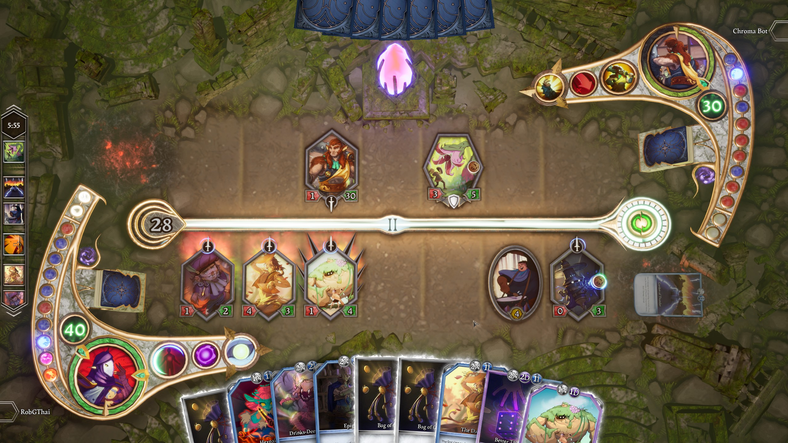

# Gameplay

In Chroma, your goal is to get your opponent hero's HP to 0 via cards and abilities. You take turn doing so until one of your HP depleted.

## Playing the card

In Chroma you have four type of cards that you can play:

**Companion**

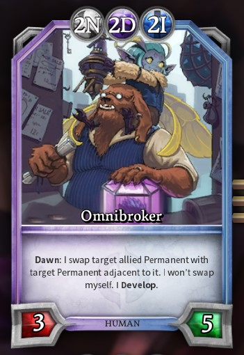

This is your conventional mean to attack. Each card have damage number (in red) and health (in green). Companion must be play into one of the seven pages in front of you. Simply drag the card on to the empty space in front of you. Companion card on the field can change between attack and guard stance as you see fit.

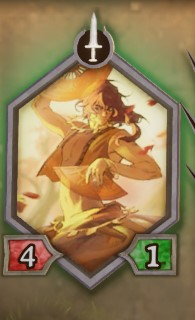 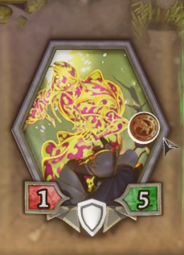

Attack stance will allow the companion to attack a target. Guard stance companion will not be able to attack but cannot be attacked with other companion as well.

Companion will leave the field once its HP depleted. They lose HP by getting attacked by other companions, spells, or abilities.

Some companions have abilities you can use with mana as well, this show up as a coin on that companion on the field.

**Spell**

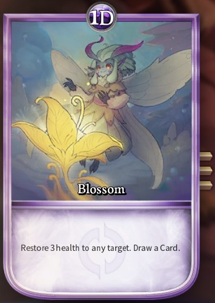

Each spell card has unique effect written on the card. In this case `Blossom`, heal any card for three HP and draw one card. Spell card does not require a page to be played and it takes no space on the board as well. The effect of spell card is a one-time use. Spell card can be used to damage guarded companion mentioned above.

**Enchantment**

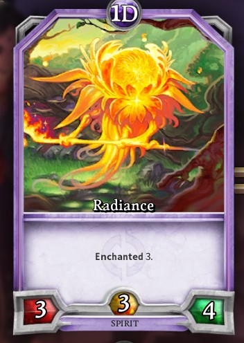

Enchantment card is similar to spell card but its effect is for a period of time. This period of time can be seen by the yellow number at the bottom of the card and counting down each of your turn. The card will leave the page once the number reach zero and the effect will stop.

Enchantment can be a stanalone card or accompanying a companion (as seen above in `Radiance`). In the case of enchanted companion; Once the companion is defeated, it will turn into enchantment on the same page. When this happens, the countdown will start.

**Landmark**

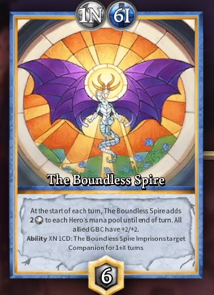

Landmark is similar to enchantment card but it has plate protecting it. Plate is similar to HP but counting instance of attack instead of damage. For example, to destroy `The Boundless Spire` above you need to attack it 6 times.

## Mana cost

Most cards required mana cost to play (This is shown on the top of the card in circles. Chroma has five types of Mana.

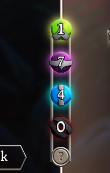

1. **A**mbition (Green)
1. **D**evotion (Purple)
1. **I**nsight (Blue)
1. **V**alor (Red)
1. **N**eutral (Gray)

To play the card, you must have enough mana of the correct type. Neutral mana type can be replaced with anything. Playable cards on your hand will glow to let you know that they can be played.

You gain more mana each turn. First turn, you have one mana. The second turn, two mana, etc. Used mana also ge replenished as well. The type of mana you gain can be seen on the mana curve on the side, this can be configured for each deck individually.

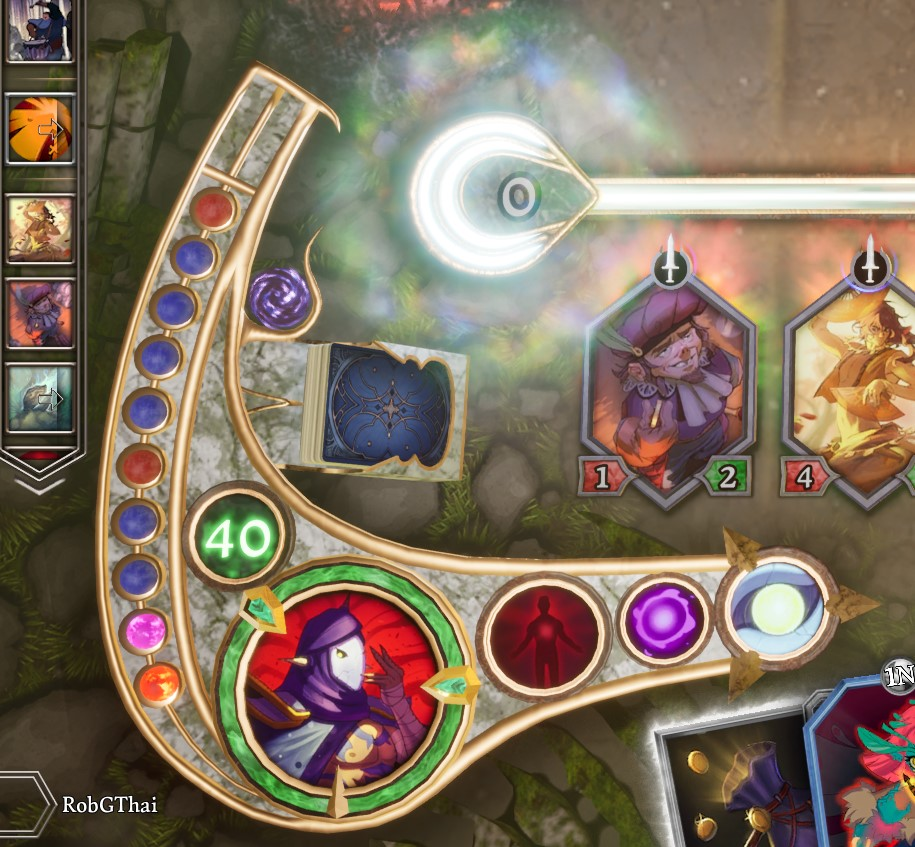

The colorful marble on the left is your Mana Curve. You gain mana from the bottom to the top. Note that the space at the top is reserved for two extra manas which you gain in Act 2.

---

## Understanding the arena

You can see both you and your opponent's information on the board. The following information are available:

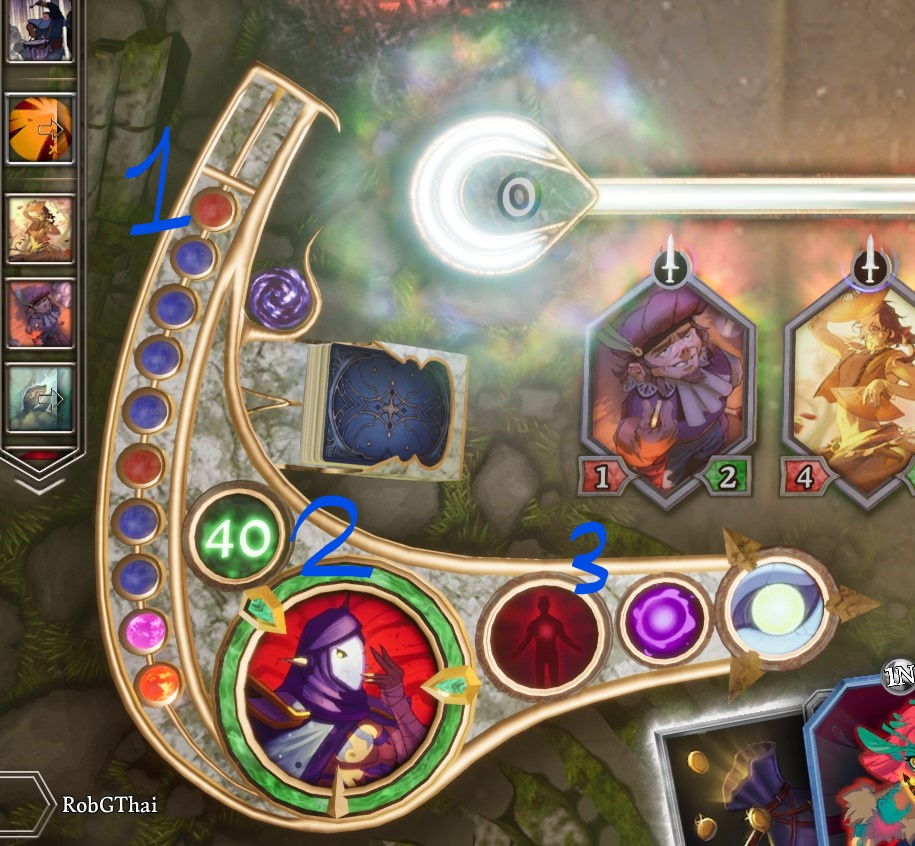

1. Mana Curve
2. Health and Barrier
3. Skills (Primary, Secondary, Ultimate in that order)

Health is displayed in both number and the ring around your avatar. You start at 40 and can have up to maximum of 80. One the ring you will see two barriers. These barriers are at 30HP and 15HP, when destroy it skip the story to the next act regardless of what the act counter might be. Barrier will absorb extra damage dealth when reach. For example, you have 31HP and getting hit for 5 damage by an opponent's companion. Instead of losing 5 HP, you will only lose one HP with Barrier absorbing the rest.

Abilities are tied to your hero, this can also be changed for each deck as well. You can hover your mouse on top of the skill to read what it does. Abilities varied per hero and there are lots of hero so it won't be covered here.

Primary and secondary skills are active from the start but the ultimate will be locked until the 3rd act. The ultimate skill can only be used once.

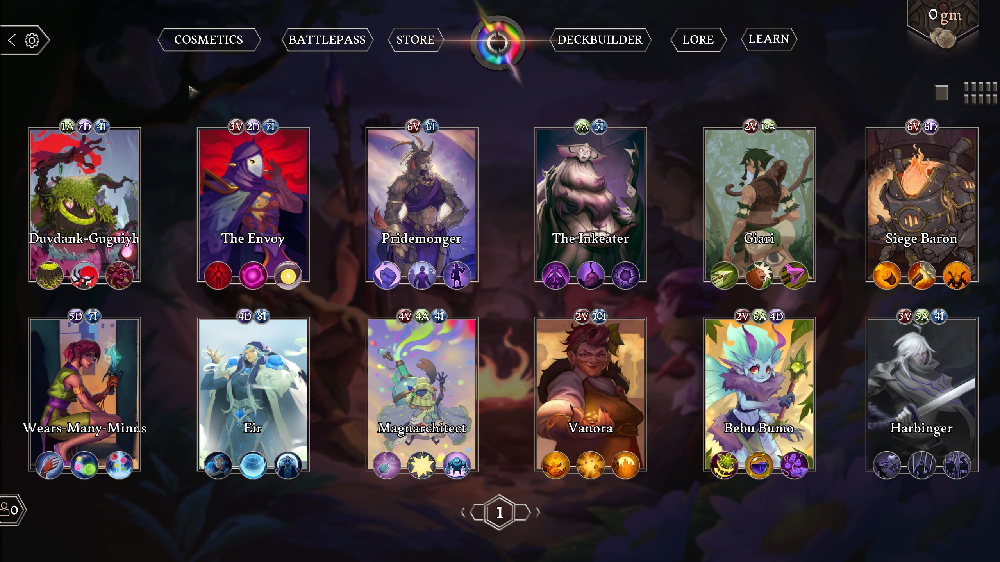

---

## Act

Chroma has three acts which progress as the game goes on.

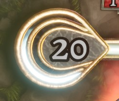 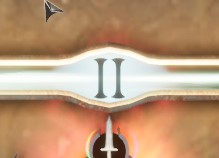

Act counter is just above your player board. The number decrease for each card being played. When reached 0 the next act begins after the current turn ended.

In the middle of the screen, you can see act number(I/II/III) displayed.

When the first 30HP barrier get destroyed, the act counter will be set to zero and progressing to the second act.
When the first 15HP barrier get destroyed, the act counter will be set to zero and progressing to the third act.

The effect in each act is as follow:

- Act I - Standard gameplay, start at the beginning.
- Act II - Add two extra manas for both players.
- Act III - Unlock ultimate skill.

---

# That should cover everything about the gameplay

However, deckbuilding is at the core of this game and all the cards are free. You might as well want to experiment with them. If you want to get playing, the game should have several decks unlocked for you from the start. Feel free to go play the game and come back if you need assistance building the deck.

---

## Deck Builder
